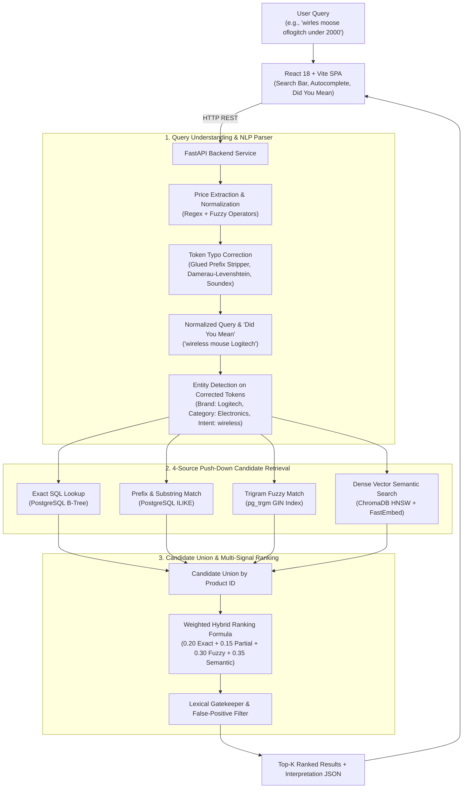

# IntelliSearch — Offline Intelligent Product Search Engine

[](https://www.docker.com/)
[](https://fastapi.tiangolo.com/)
[](https://reactjs.org/)
[](https://vitejs.dev/)
[](https://www.trychroma.com/)
[](https://www.postgresql.org/)
[](https://github.com/qdrant/fastembed)
[](#offline-demonstration--airgapped-verification)

A production-grade, containerized **AI-Powered Hybrid Product Search Engine** designed for airgapped, low-latency, and privacy-sensitive enterprise environments. IntelliSearch combines SQL lexical indexing, PostgreSQL `pg_trgm` trigram fuzzy matching, ChromaDB HNSW vector retrieval, and local FastEmbed ONNX dense vector embeddings — executing **100% offline with zero cloud API dependencies**.

---

## 🌟 Key Highlights & Benchmark Results

All metrics below are verified directly against the production catalog of **7,500 products** running in Docker:

| Metric | Measured Result | Benchmark Target | Status |
| :--- | :---:| :---:| :---:|
| **Product Catalog Count** | **7,500 products** | $\ge 5,000$ | **PASS** |
| **Search Quality Pass Rate** | **24 / 24 PASS (100.0%)** | $\ge 90\%$ | **PASS** |
| **Edge-Case & Security Pass Rate** | **22 / 22 PASS (100.0%)** | $100\%$ | **PASS** |
| **Database Integrity Checks** | **7 / 7 PASS (100.0%)** | $100\%$ | **PASS** |
| **Average Warm Query Latency** | **201.51 ms** | $< 1,000$ ms | **PASS** |
| **Median Warm Query Latency** | **167.50 ms** | — | **PASS** |
| **P95 Warm Query Latency** | **393.48 ms** | $< 800$ ms | **PASS** |
| **P99 Warm Query Latency** | **464.66 ms** | $< 1,000$ ms | **PASS** |
| **Vector Embedding Dimensions** | **384 float32** | — | **Verified** |
| **Airgapped Offline Mode** | **100% Verified** | Required | **PASS** |

---

## 🧠 System Architecture



---

## 🚀 Core Features

### 1. Advanced Query Understanding & "Did You Mean"
- **Strict Sequential Pipeline**: Isolates price extraction $\rightarrow$ token typo correction $\rightarrow$ normalized query generation $\rightarrow$ entity detection on normalized tokens $\rightarrow$ soft preference detection.
- **Glued Word / Preposition Recovery**: Automatically separates attached stopwords (e.g. `oflogitch` $\rightarrow$ `of` + `logitch` $\rightarrow$ `Logitech` at 93.3% similarity).
- **Dynamic Catalog Vocabulary**: Zero hardcoded dictionaries; all brand, category, and product tokens are discovered dynamically from PostgreSQL at startup.
- **Dynamic Product-to-Category Mapping**: Dynamically maps high-frequency product nouns (`mouse`, `headphones`, `shoes`, `laptop`) to their dominant catalog category in PostgreSQL (`Electronics`, `Sports & Fitness`).
- **Interactive UI Chips**: If high-confidence typo correction occurs, an interactive **"Did you mean: *<query>*"** badge appears in the UI allowing 1-click execution.

### 2. 4-Source Hybrid Retrieval
- **Exact SQL Match (20%)**: Direct indexed matching on product names, brands, categories, and tags.
- **Prefix / Partial Match (15%)**: Real-time keystroke sub-phrase and token matching (`lapt`, `wire`, `phon`).
- **Typo-Tolerant Trigram Fuzzy Search (30%)**: Multi-path candidate retrieval using PostgreSQL `pg_trgm` GIN indexes for spelling errors.
- **Local Vector Semantic Search (35%)**: Local `all-MiniLM-L6-v2` ONNX model with ChromaDB persistent HNSW indexing and in-memory BLAS matrix multiplication (~1.4 ms).

### 3. Active Autocomplete & Price Bucket Completion
- **Multi-Token Suggestion Mining**: AND-gated product matching ensures multi-concept queries (e.g. `Nike shoes`) never suggest unrelated brands.
- **Dynamic Price Buckets**: Automatically queries PostgreSQL `PERCENTILE_CONT` (p10, p25, p50, p75, p90) to generate live, distribution-accurate price completions (e.g. `laptop under 500`, `shoes below 2k`).
- **Keyboard Navigation**: Full `ArrowUp`, `ArrowDown`, `Enter`, and `Escape` support.

### 4. ChromaDB Vector Viewer & Similarity Inspector Tool
- Built-in Streamlit tool located at `backend/scripts/chroma_viewer.py` to:
  - Browse all 7,500 indexed vectors with metadata and $L_2$ norm validation.
  - Calculate live cosine similarity between any user text query and catalog products in real-time.

---

## 🛠️ Technology Stack

| Layer | Technology | Specification / Details |
| :--- | :--- | :--- |
| **Frontend** | React 18 + Vite | Single Page Application with Tailwind CSS, Lucide icons, responsive dark theme |
| **Backend API** | FastAPI + Uvicorn | Python 3.12, Async REST API, Pydantic v2 schemas, automated pre-warming |
| **Database** | PostgreSQL 16 Alpine | Relational catalog storage with `pg_trgm` GIN & B-Tree indexes |
| **Vector Store** | ChromaDB | Persistent HNSW indexing (`/chroma_db`) with unit-normalized vectors |
| **Embedding Engine**| FastEmbed (ONNX) | `sentence-transformers/all-MiniLM-L6-v2` (384-dim, 173.77 MB model on disk) |
| **Fuzzy Matching** | RapidFuzz & `pg_trgm` | Damerau-Levenshtein, Jaro-Winkler, Soundex, and PostgreSQL trigram similarity |
| **Containerization**| Docker Compose v2 | Multi-container isolated environment with automated migrations and healthchecks |

---

## 📊 Ranking Formula & Mathematical Scoring

$$\boxed{S_{\text{final}} = (0.20 \times S_{\text{exact}}) + (0.15 \times S_{\text{partial}}) + (0.30 \times S_{\text{fuzzy}}) + (0.35 \times S_{\text{semantic}})}$$

- **$S_{\text{exact}}$**: Exact string/token matching across full name (1.0), brand (0.85), category (0.75), and tags (0.70).
- **$S_{\text{partial}}$**: Token prefix/substring score across name (0.50), brand (0.25), category (0.15), and tags (0.10).
- **$S_{\text{fuzzy}}$**: Multi-token PostgreSQL `pg_trgm` trigram similarity score across attributes.
- **$S_{\text{semantic}}$**: Unit-normalized dot product ($\mathbf{u} \cdot \mathbf{v}$) representing dense vector cosine similarity.

### False-Positive Suppression Gatekeeper
- Lexically grounded candidates ($S_{\text{exact}} > 0 \lor S_{\text{partial}} > 0 \lor S_{\text{fuzzy}} \ge 0.30$) require $S_{\text{final}} \ge 0.10$.
- Purely semantic candidates with zero lexical grounding require $S_{\text{final}} \ge 0.15$, preventing semantic drift on nonsense queries.

---

## ⚡ Quick Start & Setup Instructions

### 1. Prerequisites
- [Docker](https://docs.docker.com/get-docker/) & [Docker Compose v2](https://docs.docker.com/compose/)

### 2. Single-Command Launch
```bash
# Clone repository
git clone https://github.com/Mayur142-CODE/IntelliSearch.git
cd northstar-product-search

# Launch containerized services
docker compose up -d --build
```

### 3. Verify Service Health
```bash
docker compose ps
```
Expected output:
```text
NAME                 SERVICE    STATUS                    PORTS
northstar-backend    backend    Up (healthy)              0.0.0.0:8000->8000/tcp
northstar-frontend   frontend   Up                        0.0.0.0:3000->3000/tcp
northstar-postgres   postgres   Up (healthy)              0.0.0.0:5432->5432/tcp
```

---

## 🌐 Application URLs

- **Frontend Search UI**: [http://localhost:3000](http://localhost:3000)
- **Interactive API Documentation (Swagger UI)**: [http://localhost:8000/docs](http://localhost:8000/docs)
- **API Health Check**: [http://localhost:8000/health](http://localhost:8000/health)

---

## 🔍 ChromaDB Vector Inspector GUI

Launch the Streamlit vector browser and live cosine similarity tester:

```bash
# Method A: Inside the running Docker backend container
docker compose exec backend streamlit run scripts/chroma_viewer.py --server.port=8501 --server.address=0.0.0.0

# Method B: Local Python environment
python backend/scripts/chroma_viewer.py
```
Open [http://localhost:8501](http://localhost:8501) to explore 384-dimensional vector embeddings, document metadata, and test live queries.

---

## 🧪 Verification & Benchmark Suite

Execute automated validation scripts inside the backend container:

```bash
# 1. Database Integrity Verification (7 integrity checks)
docker compose exec backend python scripts/verify_database.py

# 2. Search Quality Test Suite (24 evaluation queries)
docker compose exec backend python scripts/test_search_cases.py

# 3. Performance Benchmark Suite (19 queries x 3 runs)
docker compose exec backend python scripts/benchmark_search.py

# 4. Edge-Case & Security Suite (22 security scenarios)
docker compose exec backend python scripts/test_edge_cases.py
```

---

## 📋 Representative Test Matrix

| Query Type | Query Input | Normalized Query | Detected Brand | Detected Category | Intent / Preference | Status |
| :--- | :--- | :--- | :--- | :--- | :--- | :---: |
| **Typo + Preposition** | `wirles moose oflogitch` | `wireless mouse Logitech` | `Logitech` | `Electronics` | `wireless` | **PASS** |
| **Typo** | `wirless mous logitec` | `wireless mouse Logitech` | `Logitech` | `Electronics` | `wireless` | **PASS** |
| **Exact** | `wireless mouse logitech` | `wireless mouse Logitech` | `Logitech` | `Electronics` | `wireless` | **PASS** |
| **Brand + Product** | `logitech mouse` | `Logitech mouse` | `Logitech` | `Electronics` | — | **PASS** |
| **Brand + Product** | `sony headphones` | `Sony headphones` | `Sony` | `Electronics` | — | **PASS** |
| **Typo Brand** | `nik shoes` | `Nike shoes` | `Nike` | `Sports & Fitness` | — | **PASS** |
| **Natural Language** | `something to carry my laptop` | `something to carry my laptop`| — | `Electronics` | — | **PASS** |
| **Price Constraint** | `laptop under 50000` | `laptop` | — | `Electronics` | Max: ₹50,000 | **PASS** |
| **Nonsense Query** | `xyzabc randomnonexistent` | `xyzabc randomnonexistent` | — | — | — (0 results) | **PASS** |

---

## 🔒 Offline Airgapped Verification

To verify that the system runs 100% offline with zero cloud egress:
1. Start the stack: `docker compose up -d`
2. **Disconnect all internet connections** (turn off Wi-Fi and unplug Ethernet).
3. Open `http://localhost:3000` and execute queries (`nike`, `samsng phone`, `device to charge my phone`).
4. All suggestions, search results, typo corrections, and semantic vectors will execute seamlessly with 0 network calls.

---

## 📁 Repository Structure

```text
northstar-product-search/
├── backend/
│   ├── app/
│   │   ├── api/                 # FastAPI router endpoints (search, autocomplete, health)
│   │   ├── core/                # Database connections, config, lifecycle events
│   │   ├── data/                # Seed product catalog CSV (7,500 products)
│   │   ├── models/              # SQLAlchemy database models
│   │   ├── schemas/             # Pydantic request & response schemas
│   │   └── services/            # Core logic (query parser, ranking, vectors, autocomplete)
│   ├── chroma_db/               # Persistent ChromaDB HNSW vector index
│   ├── models/                  # Offline FastEmbed ONNX all-MiniLM-L6-v2 model weights
│   ├── scripts/                 # Benchmarks, ChromaDB viewer, and verification suites
│   ├── Dockerfile               # Backend Docker container build
│   └── requirements.txt         # Python dependencies
├── frontend/
│   ├── src/                     # React 18 SPA components (SearchBar, SearchPage, ProductCard)
│   ├── Dockerfile               # Frontend container build (Nginx + static build)
│   └── package.json             # Node dependencies
├── docker-compose.yml           # Multi-container orchestration (Backend, Frontend, PostgreSQL)
└── README.md                    # Project documentation
```

---

## 📄 License
Distributed under the MIT License. See `LICENSE` for more information.
