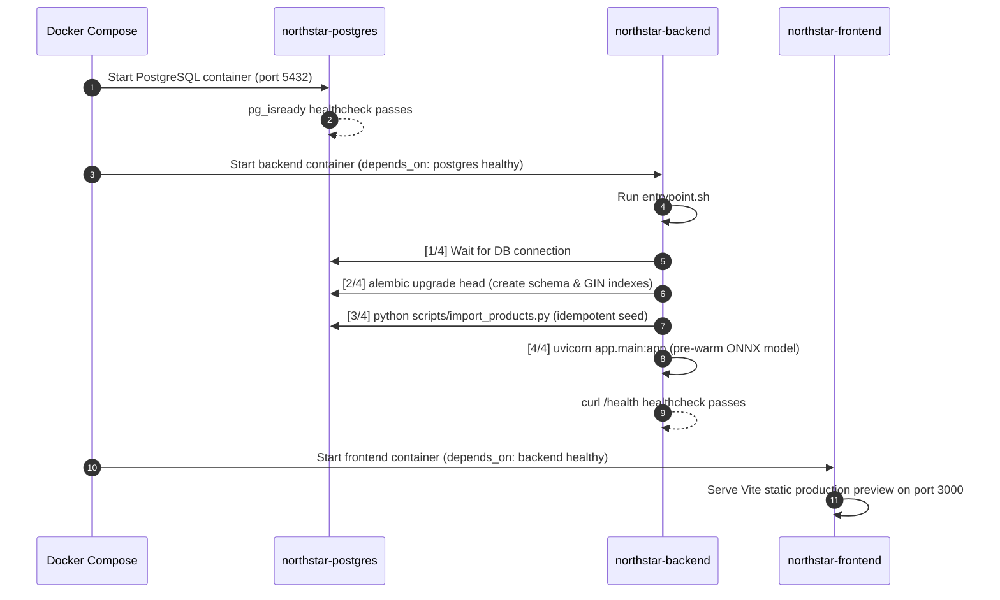

# System Architecture & Technical Specification

## 1. System Overview

The **NorthStar Offline Intelligent Product Search** system is a containerized, 3-tier web application designed for high-performance, airgapped product retrieval. The system is engineered to operate with zero external cloud dependencies, running local dense vector inference and trigram fuzzy matching on standard CPU hardware.

```
                      +-----------------------------+
                      |   Client Web Browser        |
                      |   (http://localhost:3000)   |
                      +--------------+--------------+
                                     |
                                     | HTTP REST (JSON)
                                     v
                      +-----------------------------+
                      |   Frontend (React + Vite)   |
                      |   Static Preview Container  |
                      +--------------+--------------+
                                     |
                                     | Proxy / Direct API
                                     v
                      +-----------------------------+
                      |   Backend (FastAPI)         |
                      |   Python 3.12 / Uvicorn     |
                      +-------+--------------+------+
                              |              |
           Direct SQL Queries |              | In-Memory Matrix Dot Product
                              v              v
        +-----------------------+     +-------------------------------+
        | PostgreSQL 16 DB      |     | Local FastEmbed ONNX Engine   |
        | - pg_trgm Extension   |     | - all-MiniLM-L6-v2 (384-dim)  |
        | - GIN Trigram Indexes |     | - NumPy Embeddings (7,500x384)|
        +-----------------------+     +-------------------------------+
```

---

## 2. Frontend Architecture (React 18 + Vite SPA)

### Component Hierarchy

```
App.jsx
└── SearchPage.jsx
    ├── Header (Title, Subtitle, Engine Badge)
    ├── SearchBar.jsx
    │   ├── Combobox Input (Search icon, clear button, spinner)
    │   └── Autocomplete Dropdown (Top 10 suggestions, keyboard navigable)
    ├── Example Query Pills
    ├── SearchStates.jsx (LoadingGrid / EmptyState / ErrorState)
    └── Results Grid
        └── ProductCard.jsx (Image, Brand, Title, Price, Score Breakdown Collapsible)
```

### Key Frontend Mechanisms

1. **Debounced Query Execution**:
   - Implemented via `useDebounced.js` hook with a 300ms debounce interval.
   - Prevents overwhelming the backend API during rapid keystrokes.

2. **Stale Response Protection (Race-Condition Guard)**:
   - Uses native `AbortController` stored in a `useRef`.
   - When a new query is submitted or debounced, the previous pending HTTP request is aborted immediately. Out-of-order responses from slow previous queries cannot overwrite newer results.

3. **Active Autocomplete & Keyboard Navigation**:
   - The search combobox provides an instant top-10 suggestion dropdown.
   - Supports `ArrowDown`, `ArrowUp`, `Enter` to select, and `Escape` to close.

4. **Multi-Signal Score Inspector**:
   - Each `ProductCard` includes a collapsible "Relevance Breakdown" panel displaying the exact values of:
     - Final Weighted Score
     - Exact Match Score
     - Partial/Prefix Match Score
     - Fuzzy Similarity Score
     - Semantic Similarity Score

---

## 3. Backend Architecture (FastAPI + Python 3.12)

### Directory Structure

```
backend/
├── app/
│   ├── api/
│   │   ├── __init__.py
│   │   └── search.py           # /search endpoint controller
│   ├── core/
│   │   ├── config.py           # Pydantic Settings & environment
│   │   └── database.py         # SQLAlchemy engine & sessionmaker
│   ├── models/
│   │   └── product.py          # Product ORM declarative model
│   ├── schemas/
│   │   └── search.py           # Pydantic request & response schemas
│   ├── services/
│   │   ├── search_ranking.py   # 4-source union & multi-signal scoring
│   │   ├── fuzzy_search.py     # Multi-path pg_trgm candidate retrieval
│   │   └── semantic_search.py  # FastEmbed ONNX vector similarity
│   └── main.py                 # FastAPI application, CORS, startup warmup
├── alembic/                    # Database migration definitions
├── data/
│   ├── products.csv            # Canonical dataset
│   └── embeddings/             # Precomputed .npy embeddings
├── models/
│   └── all-MiniLM-L6-v2/       # Local ONNX model weights
└── scripts/                    # Validation & benchmarking utilities
```

### API Layer & Endpoints

- **`GET /search?q={query}&limit={limit}`**: Primary search endpoint. Returns ranked results with per-signal score breakdown. Validates `limit` ($1 \le \text{limit} \le 100$).
- **`GET /health`**: Liveness probe returning `{"status": "healthy"}`.
- **`GET /db-test`**: PostgreSQL connectivity verification.
- **`GET /docs`**: OpenAPI / Swagger interactive documentation.

### Startup Eager Pre-warming Sequence

To ensure warm query latencies from the very first incoming user request, `app/main.py` executes `startup_warmup()` on application startup:
1. Loads the FastEmbed ONNX model from local disk into memory.
2. Loads the `product_embeddings.npy` (7,500 × 384 float32) and `product_ids.npy` into C-contiguous memory.
3. Executes one warm-up inference pass (`_get_query_embedding("warmup")`) to prime the ONNX Runtime JIT compiler.

---

## 4. Database Architecture (PostgreSQL 16)

### Schema Definition (`products` Table)

| Column | Type | Constraints | Description |
|---|---|---|---|
| `id` | `INTEGER` | Primary Key, Autoincrement | Unique product identifier |
| `product_name` | `VARCHAR(255)` | NOT NULL, B-Tree Index | Product title |
| `description` | `TEXT` | NOT NULL | Detailed description |
| `brand` | `VARCHAR(100)` | NOT NULL, B-Tree Index | Manufacturer / Brand name |
| `category` | `VARCHAR(100)` | NOT NULL, B-Tree Index | Product category |
| `tags` | `TEXT` | NOT NULL | Comma-separated search tags |
| `price` | `NUMERIC(10, 2)`| NOT NULL | Price in local currency |
| `image` | `TEXT` | NOT NULL | Relative image file path |

### Indexing Strategy

PostgreSQL utilizes 7 dedicated indexes to accelerate all query types:
1. `ix_products_product_name` (B-Tree on `product_name`)
2. `ix_products_brand` (B-Tree on `brand`)
3. `ix_products_category` (B-Tree on `category`)
4. `gin_products_product_name_trgm` (GIN trigram index using `gin_trgm_ops` on `product_name`)
5. `gin_products_brand_trgm` (GIN trigram index using `gin_trgm_ops` on `brand`)
6. `gin_products_category_trgm` (GIN trigram index using `gin_trgm_ops` on `category`)
7. `gin_products_tags_trgm` (GIN trigram index using `gin_trgm_ops` on `tags`)

---

## 5. Docker Orchestration & Startup Pipeline

The system is defined in `docker-compose.yml` with 3 services:



---

## 6. Offline Architecture & Deterministic Guarantees

To ensure 100% airgapped reliability:
1. **Local Model Storage**: All ONNX weights (173.77 MB) reside directly inside `backend/models/all-MiniLM-L6-v2/`.
2. **Environment Variable Enforcement**:
   - `HF_HUB_OFFLINE=1`
   - `TRANSFORMERS_OFFLINE=1`
   - Prevents any library from making remote network calls to Hugging Face or external repositories.
3. **Precomputed Embeddings**: 7,500 product embeddings are stored in `backend/data/embeddings/product_embeddings.npy` and loaded directly into memory at startup.
